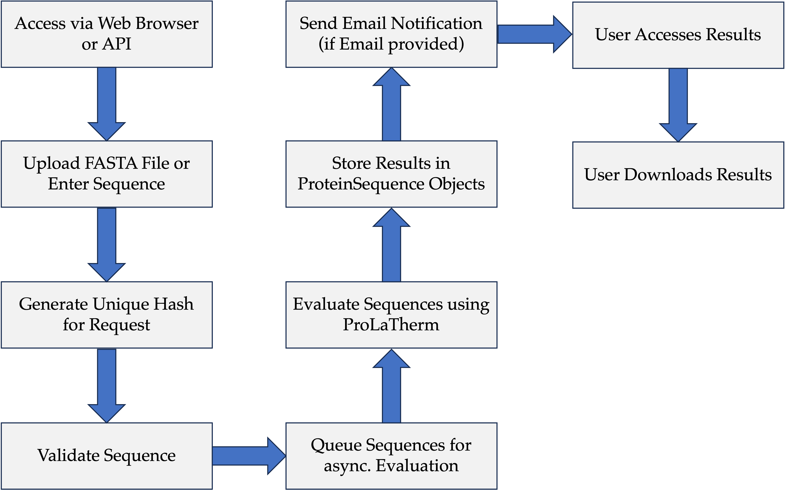

# This is my bachelor thesis.
I made a webapp for *ProLaTherm*, a machine learning model from the GrimmLab at the TUM Campus Straubing, which is used to determine whether protein sequences are thermophilic or not. These protein sequences are given in a FASTA format, either as a string or in a file, which are then validated for compliance with the FASTA format, and then evaluated. The evaluation process is quite resource intensive, so I have set up a mock evaluation function so that you can try it on your own computer without having a lot of RAM or CPU power, if you want to use the real model just set the `MOCK` value in config.py to `False`. Once the evaluation is complete, users can view their results and download them for further evaluation. They can then delete them or just keep them on the server where they are automatically deleted after 30 days. I also dockerised the application to make the setup process easier.

If you want to get a better understanding you can look at the flow chart or watch this [video](https://www.youtube.com/watch?v=0V-m4Yc3tCo) of the webbapp being used.

